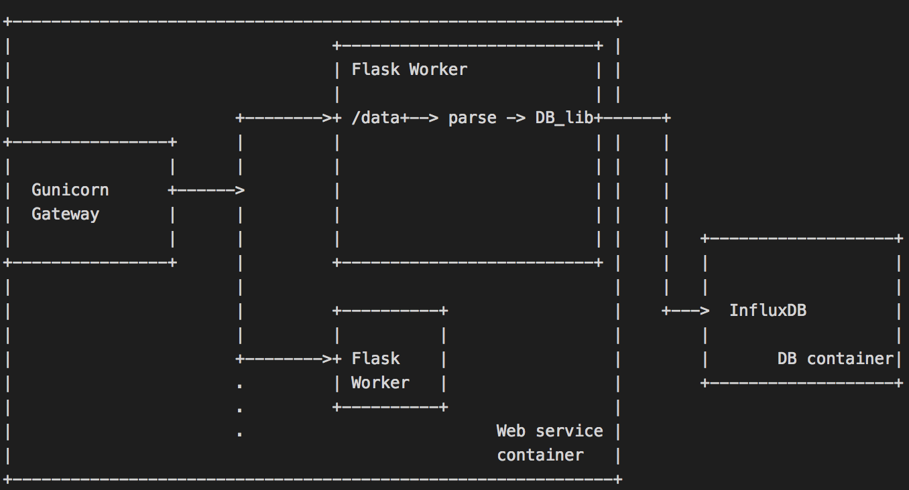

# Design

Design for Fleet Power Management tool. Using docker containers, the architecture seperates the data processing and data storage layers. Web Server Gateway also aims to serve parallel & high volume in requests.

## Design Decisions

- Containers
  - Allow easy platform indepandant deployment.
  - Allows for plug-and-play type architecture where DB can be replaced without having to replace significant parts of the code base.

- Using a DB optimized for timeseries data (i.e. InfluxDB) vs. NoSQL (e.g. MongoDB)
  - Faster ingestion/write compared to NoSQL databases with concurrent writers.
  - Lower disk storage usage due to on-disk compression of timeseries data.
  - Faster query performance.
  - Allows for a retention policy that flushes old data to minimize disk usage over long periods of time.

- Using web gateway i.e. Gunicorn
  - Allows parallel request processing. Serves more requests per second.
  - Allows other requests to continue getting served if one process is stalled due to a malformed request.
  - Allows easy scaling if expecting high number of requests.

- Python & Flask
  - Fast prototyping and existing mature libraries.
  - Multiple mature architectures for reference.
  - DB client support.
  - Pandas library for timeseries manipulation
  - Mature data analysis and machine learning libraries e.g. tensorflow and scikit-learn for analysis.

- Parsing and aggregation/disaggregation during write
  - Number of workers can always be increased and make the process parallel.
  - DB query performance is improved with simpler queries. Incoming data likely smaller than data already in DB so resource intensive aggregation/disaggregation should be done on write.

## Tradeoffs

- DB
  - InfluxDB is optimized for timeseries data, if the service is changed to serve data that requires a complex schema or join operations during queries, the DB will need to be changed.

- Flask & Python
  - Without Gunicorn, Golang would be a better candidate for a web server due to better parallel execution.
  - Gorutines are multiplexed into a lower number of OS threads and use more optimezed stacks. Therefore, there can be a higher number of gorutines compared to processes, which would allow more parallel processing.
  - Python sources are part of the deployment compared to Golang where a deployable binary can be compiled. Simplfying deployment.

- Lack of authentication
  - Other ships can update values for any ship. Authentication would enforce data integrity.

- Scaling
  - Current API does not enforce data models. I.e. input data format and values do not conform to a pre-defined Class. Once data gets more complex, data validation becomes undesiribly complex without a pre-defined model.

## Assumptions

- Verticle data scaling is more important that horizontal scaling. I.e. more timestamps and values vs. more fields (e.g. ship type)

- Data parsing & aggregation/disaggregation
  - When disaggregating energy data assume 0 for the time window where data is not reported.
  - Approx. conversion from power (kW) to energy (kWh) is acceptable. Therefore, when disaggregating power usage data, values are first averaged in 15 minute windows and then converted by multiplying (15/60) for time.
  - When aggregating data, the 'right' interval of the 15-minute time window is used. (e.g. aggregating data for times 4:00, 4:05, 4:10 will be saved with timestamp 4:15. GET queries will serve the saved timestamps)

## Edge Cases

  ### Handled

  - Missing labels (e.g. data, units, spaceship_id) in POST data.
  - Invalid timestamps in POST data
  - Negative values for energy/power usage.
  - Reject invalid start/end times in GET queries.
  - Missing start/end times in GET queries.
  - Out of range GET queries.
  - Parallel queries.

  ### Unhandled

  - Saving data labels in addition to those specified in spec.
  - Storing original timestamps.
  - Empty spaceship IDs.

## Refrences
https://www.influxdata.com/blog/influxdb-is-27x-faster-vs-mongodb-for-time-series-workloads/
https://ironboundsoftware.com/blog/2016/06/27/faster-flask-need-gunicorn/
https://docs.influxdata.com/influxdb/v1.7/concepts/schema_and_data_layout/

